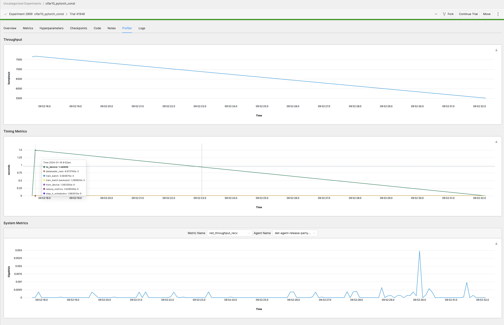

# Profiling V2

This document serves as the home page for the Q1 2024 project (deemed "Profiling V2") to revamp profiling support in Determined.

1. [Introduction](#introduction)
2. [Overview](#overview)
3. [Milestones](#milestones)
4. [Technical Details](#technical-details)
5. [Notes](#notes)

---
## Introduction

### Motivation
The process of training a model often requires comprehensive profiling to understand and optimize system performance and training performance. Determined's profiling support today exists as a mishmash of various features and integrations, each with their own limitations and idiosyncracies, and together lacking a coherent vision for usage and purpose within our platform.

The goal of this project is to organize and enhance our existing profiling support into a cohesive product and ultimately provide users with a comprehensive solution for profiling in Determined.

### Background
Today, the question of "how can I profile my training code?" does not have a straightforward answer. We support profiling through various independently-conceived features and integrations. Some of these features overlap with each other in scope, others are lacking in functionality and unintuitive to use, and many are poorly documented. 

Profiling in Determined currently consists of:

- Support for native profilers (PyTorch Profiler and TensorFlow Profiler) in `PyTorchTrial` and `TFKerasTrial`. These are configured within a trial in accordance with the native profiler's API. They collect and upload profiling metrics to be viewed in the trial's TensorBoard instance.
- Our in-house profiler (the "Determined profiler"), which collects a set of various system-related and training-related metrics at high granularity for a short period of time and are surfaced in the trial's page in the Web UI.
- Limited support for Prometheus and Grafana. We surface a Prometheus endpoint that provides some Determined-specific state information that can be used with other monitoring tools (e.g. DCGM, cAdvisor) to setup a Grafana dashboard for viewing metrics. While we do provide a guide detailing how to set this pipeline up, it must be done entirely manually by the user. 

---

## Overview

We can categorize profiling metrics into _training metrics_ and _system metrics_. System metrics (e.g. GPU/CPU utilization, disk I/O, etc.) provide insights into the device running a job and may be used to diagnose bottlenecks in computational resources. Training metrics (e.g. CUDA kernel activity, timing of certain layers and ops, etc.) provide data on the performance of a model and are used to identify the specific steps or operators slowing down a training job.

This project can be broken down into a few different components:

### Native Profiler Support
We should defer to native profilers for training-related profiling. PyTorch Profiler and TensorFlow Profiler are widely-used and full-featured profilers that are already built-in to training code, and we should integrate with these in a way that is easy to use and configure. 


### Prometheus / Grafana Integration (OUT OF SCOPE)
For fine-grained system metrics, we should fully integrate with Prometheus and Grafana. These are industry-standard tools already used by some of our users and provide full-featured profiling observability to cater to advanced use cases.

### Determined Profiler Improvements 
The Determined profiler collects both training and system profiling metrics. We should deprecate and remove support for  training-related profiling and better integrate with native profilers instead. We will maintain our support for system metrics for a few reasons:
- Users like seeing high-level profiling metrics in one integrated UI view without having to load an external page.
- Experiments running in "detached mode" will not have Prometheus integration.
- Determined profiler collects some system metrics (e.g. disk I/O, network throughput) that are not captured by native profilers.

---

## Milestones

Milestones are listed below in order of planned implementation.

Total time estimate: ~4 sprints

### Determined Profiler Improvements

| Objective                                               | Status | Ticket(s) | Estimate |
| ------------------------------------------------------- | ------ | --------- | -------- |
| **Implement Determined Profiler in Core API**           |        |           | 1 sprint |
| **Refactor Determined Profiler to use generic metrics** |        |           | 5 days   |
| - Use generic metrics APIs for persisting metrics       |        |           |          |
| - Change endpoints for fetching system metrics (Web UI) |        |           |          |
| - Deprecate existing profiling APIs                     |        |           |          |
| **Extend/remove 5 minute cap on Determined profiler**   |        |           | 3 days   |


### Native Profiler Integration

| Objective                                                          | Status | Ticket(s) | Estimate |
| ------------------------------------------------------------------ | ------ | --------- | -------- |
| **Support native DeepSpeed profiling**                             | DONE   |           |          |
| **Document native profilers**                                      | DONE   |           |          |
| **Replace Determined profiler with native profiler in Trial APIs** |        |           | 1 sprint |
| - `PyTorchTrial`                                                   |        |           |          |
| - `TFKerasTrial`                                                   |        |           |          |
| - `DeepSpeedTrial`                                                 |        |           |          |
| **Deprecate existing Determined profiler**                         |        |           | 2 days   |
| - Remove UI view (Web UI)                                          |        |           |          |


### Prometheus / Grafana Integration

| Objective                                                | Status | Ticket(s) | Estimate |
| -------------------------------------------------------- | ------ | --------- | -------- |
| Install/Run Prometheus and Grafana with deployments      |        |           | 1 sprint |
| Expose Determined system metrics in Prometheus / Grafana |        |           | 5 days   |
| Update (?) existing Grafana dashboard                    |        |           | ?        |
| Link to Grafana from trial page (+Web UI)                |        |           | 1 day    |


---

## Technical Details

### Determined Profiler
The Determined profiler exists as a relatively isolated feature in the codebase today. It is heavily coupled with Trial APIs and stored by the backend in a separate table. Since the introduction of generic metrics, we should leverage this and treat system metrics the same way as generic training metrics. This will enable support for non-Trial workloads and enable users to work with system metrics in the same way as training metrics today.

This work involves reimplementing our existing profiler support in Core API and utilizing the generic metrics framework on the backend.

- Profiler in Core API
  - Introduce a `ProfilingContext` into `CoreContext`
  - Remove configuration dependencies on experiment config
- Generic metrics
  - Backend: make sure generic metrics APIs support profiling metrics
  - Deprecate/remove existing endpoints for profiling metrics
  - WebUI: change endpoints for fetching profiling metrics
- Extend/remove current 5 minute limit on profiling
  - This exists to speed up load times on Web UI. The profiler was originally intended to capture training metrics at high granularity for a small amount of time. 
  - Investigate appropriate granularity / time cap to preserve load times on Web UI.


### Native Profilers
Since we are removing Determined profiler support for training-related profiling metrics, we should ensure that our integration with native profilers (PyTorch profiler and TF Keras profiler) supports existing to-be-deprecated Determined profiler functionality and is easy to use. 

- Port Determined profiler usage in `TFKerasTrial` and `PyTorchTrial` to use respective native profilers
  - We currently record timing of certain functions (i.e. `pytorch.to_device`, `record_metrics`, etc.) using the Determined profiler. These function calls should be replaced with native profiler calls (i.e. `torch_profiler.record_function`).
- Documentation for how to use native profilers within Determined
- Deprecate/remove Determined profiler


### Prometheus + Grafana Integration
Prometheus is somewhat supported by our system today as an optional feature. There has already been work done to expose Prometheus metrics in the Determined master. We should extend this support and fully integrate Prometheus / Grafana.
- Add Prometheus and Grafana as pre-installed dependencies across our deployments
  - Installed/pre-configured by default, but give users an option to not have it
  - Argument to `det deploy`
  - Helm chart configuration
  - Expose Grafana to the UI
- Prometheus + Grafana support for system metrics
  - Expose Determined system metrics via Prometheus
  - Review (and potentially update) [existing Grafana dashboard](https://docs.determined.ai/0.26.0/_images/grafana-example.png)
    - Disk I/O and Network I/O currently not included
- Link in experiment page to Grafana 
  - Link should automatically direct users to appropriate Grafana filter for job


## Notes
- Currently collected system metrics by Determined profiler (9):
```
GPU utilization
GPU free memory
Network throughput (send)
Network throughput (receive)
Disk IOPs
Disk thorughput (read)
Disk thorughput (write)
Free memory
CPU Utilization

"gpu_util"
"gpu_free_memory"
"net_throughput_sent"
"net_throughput_recv"
"disk_iops"
"disk_throughput_read"
"disk_throughput_write"
"free_memory"
"cpu_util_simple"
```

- Example of current profiling UI 



### Benchmarking

- granularity
  - today we collect around (10/s * 300s = 3000) metrics max per profiling/training run
- migrate old trial_profiler_metrics
- snapshot for testing: https://us-west-2.console.aws.amazon.com/rds/home?region=us-west-2#db-snapshot:engine=postgres;id=perf-test-base-snapshot

```
Timing is on.
postgres=> ALTER TABLE metrics DETACH PARTITION raw_steps;
ALTER TABLE
Time: 296.602 ms
postgres=> ALTER TABLE metrics DETACH PARTITION raw_validations;
ALTER TABLE
Time: 51.377 ms
postgres=> ALTER TABLE metrics DETACH PARTITION generic_metrics;
ALTER TABLE
Time: 46.520 ms
postgres=> ALTER TABLE metrics ATTACH PARTITION generic_metrics FOR
    VALUES IN ('GENERIC');
ALTER TABLE
Time: 141.054 ms
postgres=> ALTER TABLE metrics ATTACH PARTITION raw_validations FOR
    VALUES IN ('VALIDATION');
ALTER TABLE
Time: 376169.825 ms (06:16.170)
postgres=> ALTER TABLE metrics ATTACH PARTITION raw_steps FOR
    VALUES IN ('TRAINING');
^CCancel request sent
ERROR:  canceling statement due to user request
Time: 4302925.268 ms (01:11:42.925)
postgres=> ALTER TABLE metrics ATTACH PARTITION raw_steps FOR
    VALUES IN ('TRAINING');
ALTER TABLE
Time: 654184.608 ms (10:54.185)
postgres=> ALTER TABLE metrics DETACH PARTITION raw_steps;
ALTER TABLE
Time: 57.857 ms
postgres=> ALTER TABLE metrics ATTACH PARTITION raw_steps FOR
    VALUES IN ('TRAINING');
ALTER TABLE
Time: 113098.478 ms (01:53.098)
```
- need to support postgres >= 11=0

- partitioning
  - add constraint to speed up attach?

- nullable batches migration
  - `raw_steps` inherits parent `metrics` NOT NULL
  - dropping NOT NULL on metrics drops it on children too
  - adding them back to each individual table works


### Determined Profiler System Metrics -> Generic Metrics

- drop NOT NULL constraint on `metrics.total_batches`
  - don't need to rollback/mark archived because restarts will just continue reporting time
- make end_time reportable by client
- change profiler implementation to report to generic metrics
```
metrics = {
  "agent-A": {
    "GPU-1": {
      "gpu_util": 0.3,
      "gpu_free_memory": 1234,
    },
    "GPU-2": {
      "gpu_util": 0.3,
      "gpu_free_memory": 1234,
    }
    "avg_util": 0.3
  }
  
}
```

### Determined Profiler -> Core API
- don't report batches, in the future a better "boundary" marker to correlate is core_context.set_status
- allow collection interval to be configured

profiler.on() / profiler.start()
profiler.off() / profiler.stop()

## Links and Other Resources

[Project proposal doc](https://hpe.sharepoint.com/:w:/r/teams/detai/_layouts/15/Doc.aspx?sourcedoc=%7BBBCF1F21-B529-4FD8-BC6D-EBD11243C1DB%7D&file=ml-profiling-v2.docx&action=default&mobileredirect=true)


## Future

aggregate for each metric

would be nice if we could do "time since job/task/trial/etc started" instead of pure timestamp, but training metrics would have to do this too to be able to correlate
