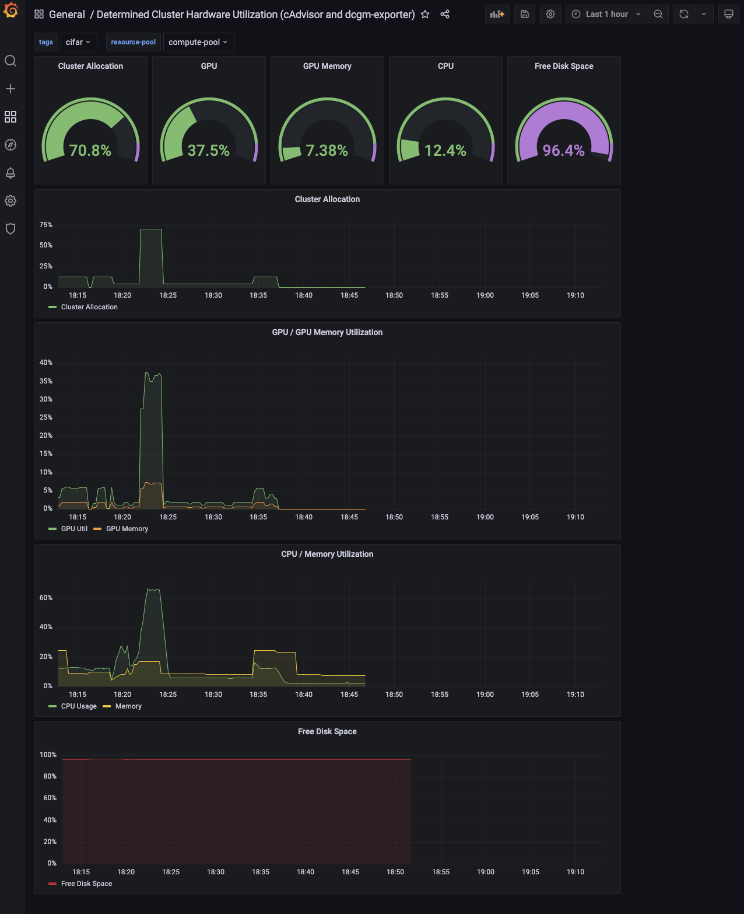

# Configuring Determined with Prometheus and Grafana
Setting up Prometheus/Grafana monitoring tools for Determined

| Supported Versions |
| :---: |
  Grafana 7.5.0+
  Prometheus 2.14.0
  Determined 0.17.8+

This document details the setup and configuration needed to enable a Grafana dashboard for monitoring hardware and system metrics on a cloud cluster (AWS or Kubernetes) running Determined. Determined exposes a Prometheus endpoint, enabled in the master configuration, containing mappings between internal task, GPU, and container definitions. The endpoint is used by Prometheus to gather relevant metrics on a cluster running Determined. 


## Reference

[Grafana](https://grafana.com/docs/grafana/latest/installation/)

[Prometheus](https://prometheus.io/docs/prometheus/latest/installation/)

[cAdvisor](https://github.com/google/cadvisor/blob/master/docs/storage/prometheus.md)

[dcgm-exporter](https://github.com/NVIDIA/dcgm-exporter)


## Constraints
The Determined Prometheus endpoint exposed is configured to work with cAdvisor for CPU metrics and DCGM for GPU metrics. Though other monitoring tools can be used with the setup, this guide will detail configuration of only the aforementioned tools. Prometheus queries for other tools may differ depending on the format and organization of the metrics returned.

## Prerequisites
- Grafana installation for dashboard monitoring
- on-cluster Prometheus instance for time-series data collection


## Configure Determined
Install and run Determined on a cluster. When launching the master instance, enable the Prometheus endpoint by adding a flag to the `master.yaml` configuration.
```
observability:
    enable_prometheus: true
```
This will expose two Prometheus API endpoints on the instance:

### /prom/det-state-metrics###

`det-state-metrics` includes mapping of various machine-level labels (GPU UUIDs, container IDs, etc.) to internal Determined entities (task, allocation, experiment labels) used by PromQL to join vectors.

### /prom/det-http-sd-config
`det-http-sd-config` contains address and resource pool information for the currently active agents, which will be used by Prometheus as targets for scraping. The endpoint is configured to support running default cAdvisor (port 8080) and DCGM (port 9400) monitoring. Other tools exposing Prometheus metrics may be used in place of cAdvisor and DCGM if they are running on these ports.


## Configure cAdvisor and dcgm-exporter
cAdvisor and dcgm-exporter must be running on the cluster agents to be monitored. This can be installed manually or run as individual Docker containers.

To easily configure dynamic agents to startup with cAdvisor and dcgm-exporter, a startup script can be added to `master.yaml`.
```
- pool_name: compute-pool
    provider:
      startup_script: |
        # Run dcgm-exporter on 9400
        docker run -d --gpus all --rm -p 9400:9400 nvcr.io/nvidia/k8s/dcgm-exporter:2.3.2-2.6.3-ubuntu20.04

        # Run cAdvisor on 8080
        VERSION=v0.36.0
        docker run \
          --volume=/:/rootfs:ro \
          --volume=/var/run:/var/run:ro \
          --volume=/sys:/sys:ro \
          --volume=/var/lib/docker/:/var/lib/docker:ro \
          --volume=/dev/disk/:/dev/disk:ro \
          --publish=8080:8080 \
          --detach=true \
          --name=cadvisor \
          --privileged \
          --device=/dev/kmsg \
          gcr.io/cadvisor/cadvisor:$VERSION
```

## Configure Prometheus
[Install Prometheus](https://prometheus.io/docs/prometheus/latest/installation/) on any node in the cluster being monitored. 

Launch Prometheus with the [provided prometheus.yml configuration](prometheus.yml).
> Info
> - `metric_relabel_configs` edits certain label names in jobs for joining in PromQL
> - `scrape_interval` values can be modified to optimize for resolution/size/time

## Configure Grafana
A Grafana instance can be installed on any machine that adds the above Prometheus address as a datasource.
Once the Prometheus datasource is connected, import the [Determined Hardware Metrics dashboard JSON](determined-hardware-grafana.json). 

## Example
After following the above steps and submitting some experiments on the cluster, you should see populated panels in the imported Grafana dashboard.

